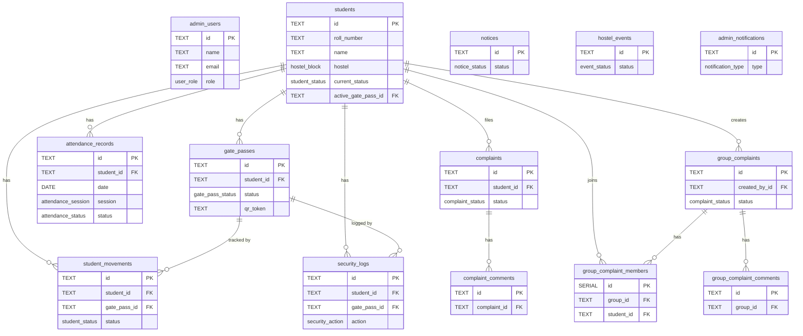

# Supabase Database Schema — GEC Hostel Admin Portal

## Overview

This project currently stores everything in **localStorage** with mock data. Migrating to Supabase gives you a real Postgres database, real-time subscriptions, built-in auth, and row-level security (RLS).

---

## 1. Database Tables & SQL

Paste each block into the **Supabase SQL Editor** and run in order.

### Enums

```sql
-- Roles
CREATE TYPE user_role AS ENUM ('ADMIN', 'PRINCIPAL', 'WARDEN', 'HOD');

-- Hostel blocks
CREATE TYPE hostel_block AS ENUM (
  'Boys Hostel A (C.V. Raman Block)',
  'Boys Hostel B (Kalam Block)',
  'Boys Hostel C (Aryabhatta Block)',
  'Girls Hostel A (Kalpana Chawla Block)',
  'Girls Hostel B (Sarojini Naidu Block)'
);

-- Student status
CREATE TYPE student_status AS ENUM ('Inside', 'Outside', 'Returned', 'Overdue');

-- Attendance session & status
CREATE TYPE attendance_session AS ENUM ('Morning', 'Evening');
CREATE TYPE attendance_status AS ENUM ('Present', 'Absent', 'Leave', 'Late', 'Not Marked');

-- Gate pass
CREATE TYPE gate_pass_status AS ENUM ('Pending', 'Approved', 'Rejected', 'Active', 'Expired', 'Used', 'Cancelled');
CREATE TYPE gate_pass_reason AS ENUM ('Medical Appointment', 'Home Visit', 'Market / Essentials', 'Coaching / Tuition', 'Academic Project', 'Emergency', 'Other');

-- Security
CREATE TYPE verification_method AS ENUM ('QR_SCAN', 'MANUAL', 'OTHER');
CREATE TYPE security_action AS ENUM ('EXIT', 'ENTRY');

-- Complaint
CREATE TYPE complaint_category AS ENUM ('Room', 'Hostel', 'Mess', 'Water', 'Electricity', 'Internet', 'Cleaning', 'Security', 'Maintenance', 'Other');
CREATE TYPE complaint_priority AS ENUM ('Low', 'Medium', 'High', 'Urgent');
CREATE TYPE complaint_status AS ENUM ('Submitted', 'Under Review', 'In Progress', 'Resolved', 'Rejected', 'Closed');
CREATE TYPE comment_author_role AS ENUM ('Admin', 'Warden', 'Student', 'Technician');

-- Notice / Event
CREATE TYPE notice_category AS ENUM ('General', 'Hostel', 'Mess', 'Maintenance', 'Emergency', 'Event', 'Discipline');
CREATE TYPE notice_priority AS ENUM ('Urgent', 'High', 'Normal');
CREATE TYPE notice_status AS ENUM ('Published', 'Scheduled', 'Draft');
CREATE TYPE notice_audience AS ENUM ('All Hostels', 'Boys Hostels', 'Girls Hostels', 'Specific Block');
CREATE TYPE event_status AS ENUM ('Upcoming', 'Ongoing', 'Completed', 'Cancelled');

-- Notification
CREATE TYPE notification_type AS ENUM ('GATE_PASS', 'STUDENT_MOVEMENT', 'AFTER_7PM', 'COMPLAINT', 'ATTENDANCE_SYNC', 'SECURITY');
```

---

### admin_users

```sql
CREATE TABLE admin_users (
  id          TEXT PRIMARY KEY,           -- e.g. ADMIN-GEC-01
  name        TEXT NOT NULL,
  email       TEXT UNIQUE NOT NULL,
  role        user_role NOT NULL,
  designation TEXT NOT NULL,
  department  TEXT NOT NULL,
  phone       TEXT NOT NULL,
  avatar_url  TEXT,
  created_at  TIMESTAMPTZ DEFAULT NOW()
);
```

> **Note**: Use **Supabase Auth** for passwords. Map `auth.users.id` → `admin_users.id` via a trigger or foreign key.

---

### students

```sql
CREATE TABLE students (
  id                TEXT PRIMARY KEY,     -- e.g. STU20260045
  name              TEXT NOT NULL,
  roll_number       TEXT UNIQUE NOT NULL, -- e.g. 2201211045
  branch            TEXT NOT NULL,
  year              TEXT NOT NULL,
  hostel            hostel_block NOT NULL,
  room              TEXT NOT NULL,
  bed               TEXT NOT NULL,
  phone             TEXT NOT NULL,
  guardian_name     TEXT NOT NULL,
  guardian_phone    TEXT NOT NULL,
  current_status    student_status DEFAULT 'Inside',
  photo_url         TEXT,
  active_gate_pass_id TEXT,              -- FK set after gate_passes table
  attendance_today  attendance_status DEFAULT 'Not Marked',
  created_at        TIMESTAMPTZ DEFAULT NOW(),
  updated_at        TIMESTAMPTZ DEFAULT NOW()
);
```

---

### gate_passes

```sql
CREATE TABLE gate_passes (
  id                    TEXT PRIMARY KEY,       -- e.g. GP-2026-00125
  student_id            TEXT NOT NULL REFERENCES students(id) ON DELETE CASCADE,
  student_name          TEXT NOT NULL,
  student_roll          TEXT NOT NULL,
  hostel                hostel_block NOT NULL,
  room                  TEXT NOT NULL,
  student_phone         TEXT NOT NULL,
  guardian_phone        TEXT NOT NULL,
  reason                gate_pass_reason NOT NULL,
  reason_detail         TEXT,
  destination           TEXT NOT NULL,
  requested_date        DATE NOT NULL,
  out_date              DATE NOT NULL,
  out_time              TEXT NOT NULL,           -- e.g. "06:15 PM"
  expected_return_date  DATE NOT NULL,
  expected_return_time  TEXT NOT NULL,           -- e.g. "09:00 PM"
  actual_exit_time      TEXT,
  actual_return_time    TEXT,
  status                gate_pass_status DEFAULT 'Pending',
  approved_by           TEXT,
  approved_date         DATE,
  approved_time         TEXT,
  rejection_reason      TEXT,
  qr_token              TEXT UNIQUE NOT NULL,
  additional_notes      TEXT,
  is_after_7pm_exit     BOOLEAN DEFAULT FALSE,
  is_after_7pm_return   BOOLEAN DEFAULT FALSE,
  created_at            TIMESTAMPTZ DEFAULT NOW(),
  updated_at            TIMESTAMPTZ DEFAULT NOW()
);

-- Back-fill the FK in students
ALTER TABLE students
  ADD CONSTRAINT fk_active_gate_pass
  FOREIGN KEY (active_gate_pass_id) REFERENCES gate_passes(id) ON DELETE SET NULL;
```

---

### student_movements

```sql
CREATE TABLE student_movements (
  id                      TEXT PRIMARY KEY,    -- e.g. MOV-<timestamp>
  student_id              TEXT NOT NULL REFERENCES students(id) ON DELETE CASCADE,
  student_name            TEXT NOT NULL,
  roll_number             TEXT NOT NULL,
  hostel                  hostel_block NOT NULL,
  room                    TEXT NOT NULL,
  gate_pass_id            TEXT NOT NULL REFERENCES gate_passes(id) ON DELETE CASCADE,
  reason                  TEXT NOT NULL,
  destination             TEXT NOT NULL,
  approved_by             TEXT NOT NULL,
  approval_date           DATE NOT NULL,
  approval_time           TEXT NOT NULL,
  out_time                TEXT NOT NULL,
  expected_return         TEXT NOT NULL,
  actual_return           TEXT,
  status                  student_status NOT NULL,
  is_after_7pm_exit       BOOLEAN DEFAULT FALSE,
  is_after_7pm_return     BOOLEAN DEFAULT FALSE,
  late_minutes            INTEGER DEFAULT 0,
  exit_verified_by        TEXT,
  exit_verification_time  TEXT,
  entry_verified_by       TEXT,
  entry_verification_time TEXT,
  created_at              TIMESTAMPTZ DEFAULT NOW(),
  updated_at              TIMESTAMPTZ DEFAULT NOW()
);
```

---

### security_logs

```sql
CREATE TABLE security_logs (
  id                    TEXT PRIMARY KEY,    -- e.g. SEC-<timestamp>
  student_id            TEXT NOT NULL REFERENCES students(id) ON DELETE CASCADE,
  student_name          TEXT NOT NULL,
  gate_pass_id          TEXT NOT NULL REFERENCES gate_passes(id) ON DELETE CASCADE,
  action                security_action NOT NULL,
  timestamp             TIMESTAMPTZ NOT NULL DEFAULT NOW(),
  time_formatted        TEXT NOT NULL,       -- e.g. "07:12 PM"
  security_guard_id     TEXT NOT NULL,
  security_guard_name   TEXT NOT NULL,
  verification_method   verification_method NOT NULL,
  notes                 TEXT,
  is_after_7pm          BOOLEAN DEFAULT FALSE,
  is_late               BOOLEAN DEFAULT FALSE,
  late_duration         TEXT,               -- e.g. "1 hour 25 minutes"
  created_at            TIMESTAMPTZ DEFAULT NOW()
);
```

---

### attendance_records

```sql
CREATE TABLE attendance_records (
  id              TEXT PRIMARY KEY,
  date            DATE NOT NULL,
  student_id      TEXT NOT NULL REFERENCES students(id) ON DELETE CASCADE,
  student_name    TEXT NOT NULL,
  hostel          hostel_block NOT NULL,
  block           TEXT NOT NULL,
  room            TEXT NOT NULL,
  session         attendance_session NOT NULL,
  status          attendance_status NOT NULL,
  attendance_time TEXT NOT NULL,
  marked_by       TEXT NOT NULL,
  synced_at       TIMESTAMPTZ,
  created_at      TIMESTAMPTZ DEFAULT NOW(),
  UNIQUE (date, student_id, session)         -- one record per student per session per day
);
```

---

### complaints

```sql
CREATE TABLE complaints (
  id               TEXT PRIMARY KEY,          -- e.g. CMP-2026-0034
  student_id       TEXT NOT NULL REFERENCES students(id) ON DELETE CASCADE,
  student_name     TEXT NOT NULL,
  roll_number      TEXT NOT NULL,
  hostel           hostel_block NOT NULL,
  room             TEXT NOT NULL,
  category         complaint_category NOT NULL,
  subject          TEXT NOT NULL,
  description      TEXT NOT NULL,
  location         TEXT NOT NULL,
  priority         complaint_priority NOT NULL,
  created_date     DATE NOT NULL,
  created_time     TEXT NOT NULL,
  assigned_to      TEXT,
  status           complaint_status DEFAULT 'Submitted',
  last_updated     TIMESTAMPTZ DEFAULT NOW(),
  attachments      TEXT[],                    -- array of URLs
  resolution_notes TEXT,
  created_at       TIMESTAMPTZ DEFAULT NOW()
);
```

---

### complaint_comments

```sql
CREATE TABLE complaint_comments (
  id           TEXT PRIMARY KEY,             -- e.g. COM-<timestamp>
  complaint_id TEXT NOT NULL REFERENCES complaints(id) ON DELETE CASCADE,
  author_name  TEXT NOT NULL,
  author_role  comment_author_role NOT NULL,
  timestamp    TIMESTAMPTZ NOT NULL DEFAULT NOW(),
  content      TEXT NOT NULL,
  is_internal  BOOLEAN DEFAULT FALSE
);
```

---

### group_complaints

```sql
CREATE TABLE group_complaints (
  id               TEXT PRIMARY KEY,          -- e.g. GRP-2026-00027
  title            TEXT NOT NULL,
  category         complaint_category NOT NULL,
  hostel           hostel_block NOT NULL,
  block            TEXT NOT NULL,
  created_by_id    TEXT NOT NULL REFERENCES students(id) ON DELETE CASCADE,
  created_by_name  TEXT NOT NULL,
  created_by_room  TEXT NOT NULL,
  members_count    INTEGER DEFAULT 1,
  priority         complaint_priority NOT NULL,
  status           complaint_status DEFAULT 'Submitted',
  created_date     DATE NOT NULL,
  assigned_to      TEXT,
  description      TEXT NOT NULL,
  resolution_notes TEXT,
  created_at       TIMESTAMPTZ DEFAULT NOW()
);
```

---

### group_complaint_members

```sql
CREATE TABLE group_complaint_members (
  id              SERIAL PRIMARY KEY,
  group_id        TEXT NOT NULL REFERENCES group_complaints(id) ON DELETE CASCADE,
  student_id      TEXT NOT NULL REFERENCES students(id) ON DELETE CASCADE,
  student_name    TEXT NOT NULL,
  roll_number     TEXT NOT NULL,
  room            TEXT NOT NULL,
  joined_date     DATE NOT NULL,
  UNIQUE (group_id, student_id)
);
```

---

### group_complaint_comments

```sql
CREATE TABLE group_complaint_comments (
  id           TEXT PRIMARY KEY,
  group_id     TEXT NOT NULL REFERENCES group_complaints(id) ON DELETE CASCADE,
  author_name  TEXT NOT NULL,
  author_role  comment_author_role NOT NULL,
  timestamp    TIMESTAMPTZ NOT NULL DEFAULT NOW(),
  content      TEXT NOT NULL,
  is_internal  BOOLEAN DEFAULT FALSE
);
```

---

### notices

```sql
CREATE TABLE notices (
  id               TEXT PRIMARY KEY,          -- e.g. NOT-2026-0123
  title            TEXT NOT NULL,
  category         notice_category NOT NULL,
  description      TEXT NOT NULL,
  priority         notice_priority NOT NULL,
  publish_date     DATE NOT NULL,
  expiry_date      DATE NOT NULL,
  status           notice_status DEFAULT 'Draft',
  author           TEXT NOT NULL,
  attachment_name  TEXT,
  attachment_url   TEXT,
  target_audience  notice_audience NOT NULL,
  created_at       TIMESTAMPTZ DEFAULT NOW(),
  updated_at       TIMESTAMPTZ DEFAULT NOW()
);
```

---

### hostel_events

```sql
CREATE TABLE hostel_events (
  id                    TEXT PRIMARY KEY,     -- e.g. EVT-2026-01
  event_name            TEXT NOT NULL,
  description           TEXT NOT NULL,
  date                  DATE NOT NULL,
  time                  TEXT NOT NULL,
  venue                 TEXT NOT NULL,
  organizer             TEXT NOT NULL,
  image_url             TEXT,
  registration_required BOOLEAN DEFAULT FALSE,
  maximum_participants  INTEGER NOT NULL,
  current_registrations INTEGER DEFAULT 0,
  status                event_status DEFAULT 'Upcoming',
  created_at            TIMESTAMPTZ DEFAULT NOW(),
  updated_at            TIMESTAMPTZ DEFAULT NOW()
);
```

---

### admin_notifications

```sql
CREATE TABLE admin_notifications (
  id          TEXT PRIMARY KEY,               -- e.g. NOTIF-<timestamp>
  title       TEXT NOT NULL,
  message     TEXT NOT NULL,
  type        notification_type NOT NULL,
  timestamp   TIMESTAMPTZ DEFAULT NOW(),
  read        BOOLEAN DEFAULT FALSE,
  link        TEXT,
  badge       TEXT,
  created_at  TIMESTAMPTZ DEFAULT NOW()
);
```

---

## 2. Row-Level Security (RLS)

Enable RLS on every table, then create policies:

```sql
-- Enable RLS on all tables
ALTER TABLE admin_users ENABLE ROW LEVEL SECURITY;
ALTER TABLE students ENABLE ROW LEVEL SECURITY;
ALTER TABLE gate_passes ENABLE ROW LEVEL SECURITY;
ALTER TABLE student_movements ENABLE ROW LEVEL SECURITY;
ALTER TABLE security_logs ENABLE ROW LEVEL SECURITY;
ALTER TABLE attendance_records ENABLE ROW LEVEL SECURITY;
ALTER TABLE complaints ENABLE ROW LEVEL SECURITY;
ALTER TABLE complaint_comments ENABLE ROW LEVEL SECURITY;
ALTER TABLE group_complaints ENABLE ROW LEVEL SECURITY;
ALTER TABLE group_complaint_members ENABLE ROW LEVEL SECURITY;
ALTER TABLE group_complaint_comments ENABLE ROW LEVEL SECURITY;
ALTER TABLE notices ENABLE ROW LEVEL SECURITY;
ALTER TABLE hostel_events ENABLE ROW LEVEL SECURITY;
ALTER TABLE admin_notifications ENABLE ROW LEVEL SECURITY;

-- Policy: authenticated admin users can read/write everything
-- (Adjust per role as needed)
CREATE POLICY "Allow authenticated access"
  ON students FOR ALL
  USING (auth.role() = 'authenticated');

-- Repeat for other tables or use a helper function per role
```

> For a hackathon you can temporarily use: `FOR ALL USING (true)` — but tighten this before production.

---

## 3. Updated_at Triggers

```sql
CREATE OR REPLACE FUNCTION set_updated_at()
RETURNS TRIGGER AS $$
BEGIN
  NEW.updated_at = NOW();
  RETURN NEW;
END;
$$ LANGUAGE plpgsql;

CREATE TRIGGER students_updated_at BEFORE UPDATE ON students FOR EACH ROW EXECUTE FUNCTION set_updated_at();
CREATE TRIGGER gate_passes_updated_at BEFORE UPDATE ON gate_passes FOR EACH ROW EXECUTE FUNCTION set_updated_at();
CREATE TRIGGER notices_updated_at BEFORE UPDATE ON notices FOR EACH ROW EXECUTE FUNCTION set_updated_at();
CREATE TRIGGER hostel_events_updated_at BEFORE UPDATE ON hostel_events FOR EACH ROW EXECUTE FUNCTION set_updated_at();
```

---

## 4. Install Supabase JS Client

```bash
npm install @supabase/supabase-js
```

---

## 5. Create `src/lib/supabase.ts`

```ts
import { createClient } from '@supabase/supabase-js';

const supabaseUrl  = import.meta.env.VITE_SUPABASE_URL;
const supabaseKey  = import.meta.env.VITE_SUPABASE_ANON_KEY;

export const supabase = createClient(supabaseUrl, supabaseKey);
```

---

## 6. `.env` File (create at project root, add to `.gitignore`)

```env
VITE_SUPABASE_URL=https://your-project-id.supabase.co
VITE_SUPABASE_ANON_KEY=your-anon-key-here
```

Get these from: **Supabase Dashboard → Project Settings → API**.

---

## 7. Entity Relationship Diagram



---

## 8. Migration Strategy (localStorage → Supabase)

| Step | Action |
|------|--------|
| 1 | Create Supabase project & run all SQL above |
| 2 | Install `@supabase/supabase-js`, add `.env` |
| 3 | Create `src/lib/supabase.ts` |
| 4 | Seed mock data via `supabase.from('students').insert(mockStudents)` in a one-off script |
| 5 | Replace `HostelContext.tsx` localStorage reads/writes with Supabase queries |
| 6 | Replace `AuthContext.tsx` mock login with `supabase.auth.signInWithPassword()` |
| 7 | Add real-time subscriptions for gate passes & notifications |

---

> [!TIP]
> After integrating, the `data/mockData.ts` file can be used as a **seed script** to pre-populate Supabase tables with realistic demo data for the hackathon.
